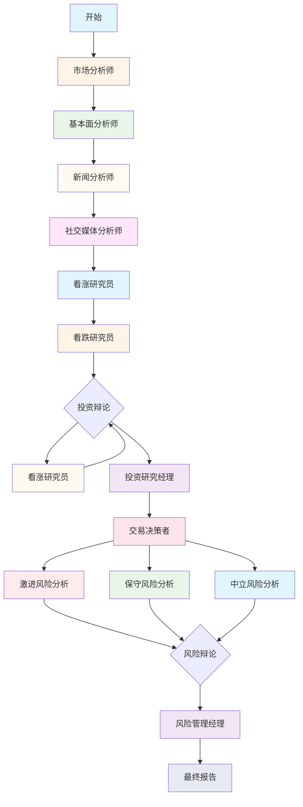

# TradingAgents-CN 数据源与分析师深度分析报告

**分析日期**: 2026-01-18
**项目版本**: v1.0.0-preview
**分析范围**: 数据源架构、数据提供器实现、分析师系统

---

## 目录

1. [数据源架构](#1-数据源架构)
2. [数据提供器实现](#2-数据提供器实现)
3. [分析师系统架构](#3-分析师系统架构)
4. [市场分析师](#4-市场分析师)
5. [基本面分析师](#5-基本面分析师)
6. [新闻分析师](#6-新闻分析师)
7. [社交媒体分析师](#7-社交媒体分析师)
8. [投资辩论团队](#8-投资辩论团队)
9. [风险辩论团队](#9-风险辩论团队)
10. [交易决策者](#10-交易决策者)
11. [数据流程分析](#11-数据流程分析)
12. [架构设计总结](#12-架构设计总结)
13. [优化建议](#13-优化建议)

---

## 1. 数据源架构

### 1.1 核心组件

```
tradingagents/dataflows/
├── data_source_manager.py      # ⭐ 数据源管理器（统一入口）
├── interface.py                 # ⭐ 公共接口层
├── optimized_china_data.py      # 优化的A股数据提供器
├── providers/                    # 数据提供器实现
│   ├── base_provider.py         # ⭐ 基类（抽象接口）
│   ├── china/                   # 中国市场数据源
│   │   ├── tushare.py          # Tushare API
│   │   ├── akshare.py          # AKShare（免费）
│   │   └── baostock.py         # BaoStock（免费）
│   ├── hk/                      # 港股数据源
│   │   ├── hk_stock.py          # 港股专用
│   │   └── improved_hk.py      # 改进版港股
│   ├── us/                      # 美股数据源
│   │   ├── yfinance.py          # Yahoo Finance（免费）
│   │   ├── finnhub.py           # Finnhub API
│   │   └── optimized.py        # 优化版美股
│   └── examples/               # 示例代码
└── cache/                       # 缓存系统
    ├── file_cache.py             # 文件缓存
    ├── db_cache.py               # 数据库缓存（MongoDB + Redis）
    ├── adaptive.py               # 自适应缓存
    └── integrated.py             # 集成缓存
```

### 1.2 数据源管理器（DataSourceManager）

**文件**: `tradingagents/dataflows/data_source_manager.py`

**核心功能**:

```python
class DataSourceManager:
    """数据源管理器 - 统一管理所有数据源"""

    def __init__(self):
        # MongoDB缓存（最高优先级）
        self.use_mongodb_cache = self._check_mongodb_enabled()
        
        # 缓存管理
        self.cache_manager = get_cache()
        
        # 数据源优先级
        self.available_sources = self._check_available_sources()
        self.current_source = self.default_source
```

**数据源枚举**:

```python
class ChinaDataSource(Enum):
    """中国股票数据源枚举"""
    MONGODB = DataSourceCode.MONGODB      # MongoDB缓存（最高优先级）
    TUSHARE = DataSourceCode.TUSHARE      # Tushare API
    AKSHARE = DataSourceCode.AKSHARE      # AKShare（免费）
    BAOSTOCK = DataSourceCode.BAOSTOCK    # BaoStock（免费）

class USDataSource(Enum):
    """美股数据源枚举"""
    MONGODB = DataSourceCode.MONGODB      # MongoDB缓存（最高优先级）
    YFINANCE = DataSourceCode.YFINANCE    # Yahoo Finance（免费）
    ALPHA_VANTAGE = DataSourceCode.ALPHA_VANTAGE  # Alpha Vantage
    FINNHUB = DataSourceCode.FINNHUB      # Finnhub
```

### 1.3 数据源切换机制

**优先级顺序**:

```
中国市场：MongoDB缓存 → 数据库配置 → AKShare → Tushare → BaoStock
美股市场：MongoDB缓存 → 数据库配置 → yfinance → Finnhub → Alpha Vantage
港股市场：MongoDB缓存 → 数据库配置 → AKShare港股 → yfinance
```

**降级逻辑**:

```python
def _get_data_source_priority_order(self, symbol: str) -> List[ChinaDataSource]:
    """
    从数据库获取数据源优先级顺序
    
    1. 从数据库读取数据源配置（支持Web后台配置）
    2. 按优先级排序（priority字段，数字越大优先级越高）
    3. 过滤出启用的数据源
    4. 过滤出支持当前市场的数据源
    """
    
    # 步骤1：识别市场类型（A股/港股/美股）
    market_category = self._identify_market_category(symbol)
    
    # 步骤2：从数据库读取配置
    config_data = db.system_configs.find_one({"is_active": True})
    data_source_configs = config_data.get("data_source_configs", [])
    
    # 步骤3：过滤和排序
    enabled_sources = []
    for ds in data_source_configs:
        if not ds.get("enabled", True):
            continue
        
        # 检查市场分类是否匹配
        market_categories = ds.get("market_categories", [])
        if market_categories and market_category:
            if market_category not in market_categories:
                continue
        
        enabled_sources.append(ds)
    
    # 按优先级排序
    enabled_sources.sort(key=lambda x: x.get("priority", 0), reverse=True)
    
    return enabled_sources
```

### 1.4 缓存架构

**缓存类型**:

1. **文件缓存** (`file_cache.py`):
   - 简单、无需外部依赖
   - 适合离线场景
   - 性能较差

2. **数据库缓存** (`db_cache.py`):
   - MongoDB缓存（持久化）
   - Redis缓存（高性能）
   - 支持分布式部署
   - 性能最优

3. **自适应缓存** (`adaptive.py`):
   - 根据环境自动选择
   - 自动降级机制

4. **集成缓存** (`integrated.py`):
   - 统一缓存接口
   - MongoDB + Redis 双缓存
   - 智能缓存策略

**缓存策略**:

```python
# 缓存优先级
1. Redis缓存（最快，适合热点数据）
2. MongoDB缓存（持久化，适合历史数据）
3. 文件缓存（兜底，简单稳定）

# 缓存失效策略
- 时间失效（TTL）
- 主动失效（数据更新时）
- 惰性失效（下次访问时检查）
```

---

## 2. 数据提供器实现

### 2.1 基类（BaseStockDataProvider）

**文件**: `tradingagents/dataflows/providers/base_provider.py`

**核心接口**:

```python
class BaseStockDataProvider(ABC):
    """数据提供器基类 - 定义统一接口"""
    
    @abstractmethod
    def connect(self) -> bool:
        """连接数据源"""
        pass
    
    @abstractmethod
    async def get_stock_list(self) -> Optional[List[Dict]]:
        """获取股票列表"""
        pass
    
    @abstractmethod
    async def get_historical_data(
        self, symbol, start_date, end_date, period="daily"
    ) -> Optional[pd.DataFrame]:
        """获取历史K线数据"""
        pass
    
    @abstractmethod
    async def get_stock_quotes(self, symbol) -> Optional[Dict]:
        """获取实时行情"""
        pass
    
    @abstractmethod
    async def get_financial_data(self, symbol) -> Optional[Dict]:
        """获取财务数据"""
        pass
```

### 2.2 Tushare Provider（已修复）

**文件**: `tradingagents/dataflows/providers/china/tushare.py`

**已修复内容**:

```python
class TushareProvider(BaseStockDataProvider):
    def connect_sync(self) -> bool:
        """同步连接到Tushare"""
        
        # 🔥 检查TUSHARE_ENABLED开关
        tushare_enabled = os.getenv("TUSHARE_ENABLED", "true").lower() in ("true", "1", "yes", "on")
        
        # 🔥 优先从数据库读取 Token
        db_token = self._get_token_from_database()
        env_token = self.config.get("token")
        
        # 尝试数据库 Token
        if db_token:
            ts.set_token(db_token)
            self.api = ts.pro_api()
            
            # 🔥 根据 tushareReadme.txt 要求，设置必要的属性
            self.api._DataApi__token = db_token
            self.api._DataApi__http_url = 'https://jiaoch.site'
            
            # 测试连接
            test_data = self.api.stock_basic(list_status="L", limit=1)
            
            if test_data is not None and not test_data.empty:
                self.connected = True
                self.token_source = "database"
                return True
        
        # 降级到环境变量 Token
        if env_token:
            ts.set_token(env_token)
            self.api = ts.pro_api()
            
            # 🔥 设置必要属性
            self.api._DataApi__token = env_token
            self.api._DataApi__http_url = 'https://jiaoch.site'
            
            test_data = self.api.stock_basic(list_status="L", limit=1)
            
            if test_data is not None and not test_data.empty:
                self.connected = True
                self.token_source = "env"
                return True
        
        return False
```

**支持的功能**:

| 功能 | API 端点 | 说明 |
|------|---------|------|
| 股票列表 | `stock_basic()` | 上市股票列表 |
| 历史K线 | `daily()` | 日K线数据 |
| 实时行情 | `rt_k()` | 实时行情（通配符批量获取） |
| 财务数据 | `income()`, `balancesheet()`, `cashflow()` | 财务三张表 |
| 财务指标 | `fina_indicator()` | PE、PB、ROE等 |
| 新闻数据 | `news()` | 新闻数据（需要权限） |

### 2.3 AKShare Provider

**文件**: `tradingagents/dataflows/providers/china/akshare.py`

**特点**:
- ✅ 免费，无需API Key
- ✅ 数据覆盖全面
- ✅ 更新及时
- ⚠️ 无访问频率限制

**支持的市场**:
- A股市场
- 港股市场
- 美股市场
- 期货、基金等

### 2.4 BaoStock Provider

**文件**: `tradingagents/dataflows/providers/china/baostock.py`

**特点**:
- ✅ 免费，无需注册
- ✅ 复权数据完整
- ✅ 支持沪深行情
- ⚠️ 数据更新有延迟

### 2.5 美股数据提供器

**Yahoo Finance** (`yfinance.py`):
- ✅ 免费开源
- ✅ 全球市场覆盖
- ✅ 历史数据完整
- ⚠️ 可能有频率限制

**Finnhub** (`finnhub.py`):
- ✅ API稳定
- ✅ 数据质量高
- ✅ 免费额度充足
- ⚠️ 需要API Key

---

## 3. 分析师系统架构

### 3.1 分析师分类

```
tradingagents/agents/
├── analysts/                    # 分析师
│   ├── market_analyst.py       # 市场分析师（技术分析）
│   ├── fundamentals_analyst.py  # 基本面分析师
│   ├── news_analyst.py         # 新闻分析师
│   └── social_media_analyst.py  # 社交媒体分析师
├── researchers/                # 研究员（辩论团队）
│   ├── bull_researcher.py       # 看涨研究员
│   └── bear_researcher.py       # 看跌研究员
├── managers/                   # 管理者
│   ├── research_manager.py      # 投资研究经理
│   └── risk_manager.py         # 风险管理经理
└── risk_mgmt/                   # 风险管理团队
    ├── aggressive_debator.py    # 激进风险分析
    ├── conservative_debator.py  # 保守风险分析
    └── neutral_debator.py       # 中立风险分析
```

### 3.2 执行流程



### 3.3 状态管理

**AgentState** (基础状态):
```python
class AgentState(TypedDict):
    company_of_interest: str  # 股票代码
    trade_date: str            # 交易日期
    messages: List[BaseMessage]  # 消息历史
    market_report: str         # 市场分析报告
    fundamentals_report: str   # 基本面分析报告
    news_report: str          # 新闻分析报告
    sentiment_report: str      # 社交媒体情绪报告
    final_report: str         # 最终综合报告
```

**InvestDebateState** (投资辩论状态):
```python
class InvestDebateState(TypedDict):
    history: str               # 辩论历史
    bull_history: str         # 看涨历史
    current_response: str      # 当前响应
    investment_plan: str       # 投资计划
```

**RiskDebateState** (风险辩论状态):
```python
class RiskDebateState(TypedDict):
    history: str               # 辩论历史
    current_response: str      # 当前响应
    risk_assessment: str       # 风险评估
```

---

## 4. 市场分析师

**文件**: `tradingagents/agents/analysts/market_analyst.py`

### 4.1 职责

1. **技术指标分析**
   - 移动平均线（MA5, MA10, MA20, MA60）
   - MACD（指数平滑异同移动平均线）
   - RSI（相对强弱指数）
   - 布林带（BOLL）

2. **价格趋势分析**
   - 识别趋势方向（上涨/下跌/震荡）
   - 分析支撑位和阻力位
   - 评估价格波动性

3. **市场情绪判断**
   - 基于技术指标判断市场情绪
   - 识别超买超卖信号
   - 提供技术面投资建议

### 4.2 工具使用

```python
tools = [toolkit.get_stock_market_data_unified]
```

**统一工具说明**:
- 自动识别股票类型（A股/港股/美股）
- 自动调用相应的数据源
- 自动扩展日期范围（365天）
- 标准化输出格式

### 4.3 提示词设计

**强制要求**:
- ❌ 禁止在没有调用工具的情况下直接回答
- ❌ 禁止编造任何技术指标数据
- ❌ 禁止基于推测或假设生成分析内容
- ✅ 第一个动作必须是调用工具
- ✅ 所有技术指标数值必须使用工具返回的实际数据

**输出格式**:
```markdown
## 📊 股票基本信息
- 公司名称：{company_name}
- 股票代码：{ticker}
- 所属市场：{market_name}

## 📈 技术指标分析
[在这里分析移动平均线、MACD、RSI、布林带等技术指标，提供具体数值]

## 📉 价格趋势分析
[在这里分析价格趋势，考虑市场特点]

## 💭 投资建议
[在这里给出明确的投资建议：买入/持有/卖出]
```

### 4.4 死循环防护

```python
# 工具调用计数器
tool_call_count = state.get("market_tool_call_count", 0)
max_tool_calls = 3

if tool_call_count >= max_tool_calls:
    logger.warning("⚠️ 市场分析师工具调用次数已达上限，跳过")
    return {"market_report": "无法获取数据"}
```

---

## 5. 基本面分析师

**文件**: `tradingagents/agents/analysts/fundamentals_analyst.py`

### 5.1 职责

1. **财务数据获取**
   - 利润表（营业收入、净利润等）
   - 资产负债表（总资产、负债等）
   - 现金流量表（经营现金流等）
   - 财务指标（PE、PB、ROE等）

2. **估值分析**
   - PE（市盈率）估值
   - PB（市净率）估值
   - PEG（市盈增长比率）
   - 行业对比分析

3. **财务健康度评估**
   - 盈利能力（ROE、ROA、毛利率）
   - 偿债能力（资产负债率、流动比率）
   - 成长性（营收增长率、净利润增长率）

### 5.2 数据获取范围

```python
def _calculate_date_range(current_date: str, days: int = 10) -> tuple[str, str]:
    """
    计算分析的日期范围
    
    基本面分析主要依赖财务数据（PE、PB、ROE等），只需要当前股价。
    获取指定天数的数据是为了保证能拿到数据（处理周末/节假日/数据延迟），
    但实际分析只使用最近几天的数据。
    """
    end_date_dt = datetime.strptime(current_date, "%Y-%m-%d")
    start_date_dt = end_date_dt - timedelta(days=days)
    return start_date_dt.strftime("%Y-%m-%d"), current_date
```

### 5.3 强制工具调用

**核心机制**:
```python
def fundamentals_analyst_node(state):
    # 检查是否已有工具结果
    has_tool_result = _count_tool_messages(messages) > 0
    
    # 关键：只有当有工具结果时才跳过工具调用
    if has_tool_result:
        # 检查是否已有有效的分析内容
        if _has_valid_analysis_content(result):
            logger.info("✅ 基本面分析师已有有效分析，跳过工具调用")
            return state
    
    # 否则强制调用工具
    logger.info("🔄 基本面分析师必须调用工具获取数据")
    
    # 强制调用 get_stock_fundamentals_unified
    tools = [toolkit.get_stock_fundamentals_unified]
    response = llm.invoke(prompt)
```

### 5.4 输出格式

```markdown
## 📊 公司基本面概况
- 公司名称：{company_name}
- 股票代码：{ticker}
- 所属行业：{industry}

## 💰 估值分析
- 市盈率（PE）：{value}（估值水平）
- 市净率（PB）：{value}（估值水平）
- 市销率（PS）：{value}（估值水平）
- 估值评估：{under/over/fair}（低估/高估/合理）

## 📈 盈利能力分析
- ROE（净资产收益率）：{value}（盈利能力评级）
- ROA（总资产收益率）：{value}（资产利用效率）
- 毛利率：{value}（盈利空间）
- 净利率：{value}（最终盈利能力）

## 💳 偿债能力分析
- 资产负债率：{value}（财务风险）
- 流动比率：{value}（短期偿债能力）
- 速动比率：{value}（即时偿债能力）
- 财务风险评级：{low/medium/high}

## 📊 成长性分析
- 营业收入增长率：{value}（近N年）
- 净利润增长率：{value}（近N年）
- 利润增长率：{value}（近N年）
- 成长性评级：{strong/moderate/weak}

## 💡 投资建议
基于以上基本面分析：{投资建议}
```

### 5.5 辅助函数

**工具消息计数**:
```python
def _count_tool_messages(messages: list) -> int:
    """统计消息历史中的工具消息数量"""
    return sum(1 for msg in messages if isinstance(msg, ToolMessage))
```

**工具结果检查**:
```python
def _has_tool_result(messages: list) -> bool:
    """检查消息历史中是否已有工具返回结果"""
    return any(isinstance(msg, ToolMessage) for msg in messages)
```

**分析内容验证**:
```python
def _has_valid_analysis_content(result: Any, min_length: int = 500) -> bool:
    """检查LLM返回是否包含有效的分析内容"""
    if not hasattr(result, 'content') or not result.content:
        return False
    content_length = len(str(result.content))
    return content_length > min_length
```

---

## 6. 新闻分析师

**文件**: `tradingagents/agents/analysts/news_analyst.py`

### 6.1 职责

1. **新闻获取**
   - 获取最新的实时新闻（优先15-30分钟内）
   - 多源聚合（新浪财经、东方财富、财联社等）
   - 新闻时效性验证

2. **新闻分析**
   - 评估新闻事件的紧急程度和市场影响
   - 识别可能影响股价的关键信息
   - 分析新闻的时效性和可靠性

3. **影响评估**
   - 评估新闻对股价的短期影响（1-3天）
   - 分析新闻的利好/利空程度
   - 对比历史类似事件的市场反应

### 6.2 统一新闻工具

```python
# 创建统一新闻工具
unified_news_tool = create_unified_news_tool(toolkit)
unified_news_tool.name = "get_stock_news_unified"

tools = [unified_news_tool]
```

**自动识别股票类型**:
- A股：调用中国财经新闻源
- 美股：调用Finnhub、Yahoo Finance等
- 港股：调用东方财富、新浪等

### 6.3 新闻源优先级

**A股市场**:
1. 财联社（权威、时效快）
2. 新浪财经（覆盖全面）
3. 东方财富（数据丰富）
4. 腾讯财经（专业分析）
5. 同花顺（投资者社区）

**美股市场**:
1. Finnhub News
2. Yahoo Finance News
3. Alpha Vantage News
4. Google News

**港股市场**:
1. 东方财富港股
2. 新浪财经港股
3. 财联社港股

### 6.4 提示词设计

**重点关注的新闻类型**:
- 财报发布和业绩指导
- 重大合作和并购消息
- 政策变化和监管动态
- 突发事件和危机管理
- 行业趋势和技术突破
- 管理层变动和战略调整

**分析要点**:
- 新闻的时效性（发布时间距离现在多久）
- 新闻的可信度（来源权威性）
- 市场影响程度（对股价的潜在影响）
- 投资者情绪变化（正面/负面/中性）
- 与历史类似事件的对比

**输出格式**:
```markdown
## 📰 重要新闻汇总
### {时间段}内的关键新闻事件

### 🔥 最高影响力新闻
[新闻标题]
- 发布时间：{time}
- 新闻来源：{source}
- 市场影响评估：{high/medium/low}

## 📊 新闻影响分析
- 短期影响（1-3天）：{分析}
- 市场情绪变化：{分析}
- 与历史事件对比：{分析}

## 💭 基于新闻的投资建议
- 交易时机建议：{建议}
- 持仓调整建议：{建议}
- 风险提示：{风险}
```

---

## 7. 社交媒体分析师

**文件**: `tradingagents/agents/analysts/social_media_analyst.py`

### 7.1 职责

1. **情绪监控**
   - 监控中国主要财经平台的投资者情绪
   - 分析雪球、东方财富股吧等社区讨论
   - 追踪社交媒体热度变化

2. **热点识别**
   - 识别影响股价的热点事件和市场传言
   - 分析政策变化对投资者情绪的影响
   - 评估散户与机构投资者的观点差异

3. **情绪量化**
   - 情绪指数评分（1-10分）
   - 情绪变化趋势分析
   - 极端情绪点识别

### 7.2 重点关注平台

**财经新闻平台**:
- 财联社
- 新浪财经
- 东方财富
- 腾讯财经

**投资社区**:
- 雪球
- 东方财富股吧
- 同花顺
- 蛋牛

**社交平台**:
- 微博财经大V
- 知乎投资话题
- 抖音财经

**专业分析**:
- 各大券商研报
- 财经自媒体
- 投资大师观点

### 7.3 统一情绪工具

```python
tools = [toolkit.get_stock_sentiment_unified]
```

**自动识别**:
- 股票类型（A股/港股/美股）
- 平台类型（国内/国外）
- 数据源调用

### 7.4 输出格式

```markdown
## 📊 社交媒体情绪指数
- 情绪指数评分：{1-10}（1极度悲观，10极度乐观）
- 情绪变化趋势：{rising/stable/declining}（上升/稳定/下降）
- 情绪强度：{strong/moderate/weak}（强度）

## 👥 投资者群体分析
- 散户情绪：{分析}
- 机构观点：{分析}
- 意见分歧度：{high/medium/low}（分歧程度）

## 📈 情绪与股价关联性
- 当前情绪与走势关系：{分析}
- 情绪反转信号：{signal/no signal}（反转信号）
- 历史情绪对比：{对比分析}

## 💭 基于情绪的投资建议
- 情绪驱动的交易时机：{时机建议}
- 短期价格波动预期：{波动幅度}
- 反情绪策略：{策略建议}
```

### 7.5 数据验证要求

```python
# 情绪指数评分是否合理？（通常 1-10 分）
# 情绪变化趋势是否符合实际数据？
# 投资者情绪分析是否基于具体讨论内容？
# KOL观点是否有实际引用？
# 是否有矛盾的情绪数据点？
# 所有情绪评分必须使用工具返回的实际数据，不允许编造
```

---

## 8. 投资辩论团队

### 8.1 看涨研究员

**文件**: `tradingagents/agents/researchers/bull_researcher.py`

**职责**:
- 建立看涨论证
- 收集看涨证据
- 反驳看跌观点
- 使用历史记忆学习

**记忆检索**:
```python
past_memories = memory.get_memories(curr_situation, n_matches=5)

for i, rec in enumerate(past_memories, 1):
    past_memory_str += rec["recommendation"] + "\n\n"
```

**数据验证清单**:
- [ ] PE/PB比率是否合理？
- [ ] ROE是否在合理范围？
- [ ] 增长率是否合理？
- [ ] 估值方法是否一致？
- [ ] 是否有编造数据？

### 8.2 看跌研究员

**文件**: `tradingagents/agents/researchers/bear_researcher.py`

**职责**:
- 建立看跌论证
- 识别风险因素
- 挑战看涨观点
- 使用历史记忆学习

**风险识别**:
- 估值过高风险
- 行业周期风险
- 财务恶化风险
- 宏观经济风险
- 竞争加剧风险

### 8.3 辩论机制

**配置参数**:
```python
# tradingagents/default_config.py
"max_debate_rounds": 3,        # 3轮辩论 = 6次交锋
```

**辩论流程**:
```
第1轮：
  看涨研究员 → 看跌研究员 → 看跌研究员 → 看涨研究员
  
第2轮：
  看涨研究员 → 看跌研究员 → 看跌研究员 → 看涨研究员
  
第3轮：
  看涨研究员 → 看跌研究员 → 看跌研究员 → 看涨研究员
  
总结阶段：
  投资研究经理 → 投资计划 → 交易决策者
```

**辩论历史累积**:
```python
InvestDebateState:
  history: str           # 完整辩论历史
  bull_history: str       # 看涨观点历史
  current_response: str   # 当前响应
  investment_plan: str   # 投资计划
```

---

## 9. 风险辩论团队

### 9.1 风险分析师类型

**激进风险分析**:
- 评估最大可能损失
- 考虑极端市场情况
- 强调下行风险

**保守风险分析**:
- 评估最安全的情况
- 考虑历史最低点
- 强调安全性

**中立风险分析**:
- 平衡评估
- 考虑正常市场波动
- 提供平衡观点

### 9.2 辩论机制

**配置参数**:
```python
"max_risk_discuss_rounds": 2,  # 2轮辩论 = 6次交锋
```

**辩论流程**:
```
第1轮：
  激进分析 → 保守分析 → 中立分析 → 激进分析
  
第2轮：
  激进分析 → 保守分析 → 中立分析 → 激进分析
  
总结阶段：
  风险管理经理 → 最终决策
```

### 9.3 风险评估维度

**市场风险**:
- 市场整体波动
- 行业周期影响
- 宏观经济风险

**个股风险**:
- 基本面恶化风险
- 估值过高风险
- 流动性风险
- 政策监管风险

**技术风险**:
- 技术破位风险
- 交易量萎缩风险
- 技术形态恶化

---

## 10. 交易决策者

**文件**: `tradingagents/agents/trader/trader.py`

### 10.1 职责

1. **综合决策**
   - 汇总所有分析师报告
   - 综合投资辩论结果
   - 综合风险评估结果

2. **投资计划制定**
   - 明确投资建议（买入/持有/卖出）
   - 设定目标价格区间
   - 制定分批建仓/平仓策略
   - 设置止盈止损位

3. **决策验证**
   - 验证决策的完整性
   - 确保包含所有必要要素
   - 检查数据合理性

### 10.2 决策验证函数

```python
def validate_trading_decision(content: str, currency_symbol: str, company_name: str) -> dict:
    """
    验证交易决策的有效性
    
    检查项：
    1. 是否包含投资建议（买入/持有/卖出）
    2. 是否包含目标价位
    3. 货币单位是否正确
    4. 是否包含"无法确定"等回避语句
    5. 是否包含置信度评分
    6. 是否包含风险评分
    """
    result = {
        "is_valid": True,
        "warnings": [],
        "has_target_price": False,
        "recommendation": "未知"
    }
    
    # 1. 检查投资建议
    if not re.search(r'(买入|持有|卖出)', content):
        result["warnings"].append("未找到明确的投资建议（买入/持有/卖出）")
        result["recommendation"] = "未知"
    
    # 2. 检查目标价位
    if not re.search(r'[¥$￥]\s*\d+\.?\d*', content):
        result["warnings"].append("未找到具体的目标价位")
        result["has_target_price"] = False
        result["is_valid"] = False
    
    # 3. 检查货币单位
    if currency_symbol == "¥" and "$" in content and "¥" not in content:
        result["warnings"].append(f"A股 {company_name} 应使用人民币(¥)")
    
    # 4. 检查回避语句
    evasive_patterns = ['无法确定', '需要更多信息', '无法提供', '不确定', '暂时无法']
    for pattern in evasive_patterns:
        if re.search(pattern, content):
            result["warnings"].append(f"检测到回避性语句: '{pattern}'")
    
    # 5. 检查置信度
    if not re.search(r'置信度[：:]\s*\d+\.?\d+', content):
        result["warnings"].append("未找到置信度评分")
    
    # 6. 检查风险评分
    if not re.search(r'风险评分[：:]\s*\d+\.?\d+', content):
        result["warnings"].append("未找到风险评分")
    
    return result
```

### 10.3 输出格式

```markdown
## 🎯 最终交易建议

### 投资建议
**{买入/持有/卖出}**

### 理由
[投资决策的主要理由]

### 投资计划

#### 分批建仓策略
- 第一批：{价格区间}，{仓位比例}
- 第二批：{价格区间}，{仓位比例}
- 第三批：{价格区间}，{仓位比例}

#### 止盈止损
- 止盈位：{price}（{幅度}%）
- 止损位：{price}（{幅度}%）

#### 时间规划
- 短期（1个月）：{目标价格}
- 中期（3个月）：{目标价格}
- 长期（6个月）：{目标价格}

### 风险提示
[基于风险辩论的风险提示]

### 置信度
- 置信度：{0-100}分
- 风险评分：{0-10}分
- 建议仓位：{比例}%
```

---

## 11. 数据流程分析

### 11.1 完整执行流程

```
┌─────────────────────────────────────────────────────────────┐
│                     TradingAgentsGraph                        │
└─────────────────────────────────────────────────────────────┘
                              │
        ┌───────────────────────┼───────────────────────┐
        │                       │                       │
        ▼                       ▼                       ▼
  ┌─────────┐          ┌─────────┐          ┌─────────┐
  │ 数据源管理 │          │ 工具系统  │          │ 提示词管理│
  └─────────┘          └─────────┘          └─────────┘
        │                       │                       │
        ▼                       ▼                       │
  ┌─────────────────────────────────────────────────────┐
  │                    数据提供器层                      │
  │  (Tushare/AKShare/Baostock/yfinance/Finnhub)       │
  └─────────────────────────────────────────────────────┘
        │
        ▼
  ┌─────────────────────────────────────────────────────┐
  │                    缓存层                          │
  │  (Redis/MongoDB/File)                               │
  └─────────────────────────────────────────────────────┘
        │
        ▼
  ┌─────────────────────────────────────────────────────┐
  │                  分析师团队                          │
  │  (市场/基本面/新闻/社交媒体)                       │
  └─────────────────────────────────────────────────────┘
        │
        ▼
  ┌─────────────────────────────────────────────────────┐
  │                辩论团队                             │
  │  (看涨/看跌研究员 + 投资研究经理)                 │
  └─────────────────────────────────────────────────────┘
        │
        ▼
  ┌─────────────────────────────────────────────────────┐
  │               风险管理团队                         │
  │  (激进/保守/中立 + 风险管理经理)                 │
  └─────────────────────────────────────────────────────┘
        │
        ▼
  ┌─────────────────────────────────────────────────────┐
  │               交易决策者                           │
  └─────────────────────────────────────────────────────┘
        │
        ▼
  ┌─────────────────────────────────────────────────────┐
  │                最终报告                             │
  └─────────────────────────────────────────────────────┘
```

### 11.2 数据获取流程

**流程1：市场数据获取**
```python
1. 用户输入股票代码（如 600765）
2. StockUtils.get_market_info(ticker) 识别市场类型
3. get_stock_market_data_unified(ticker) 调用统一工具
4. 数据源管理器选择数据源：
   - 检查 MongoDB 缓存
   - 读取数据库配置
   - 按优先级选择数据源
5. 数据提供器获取数据：
   - TushareProvider.get_historical_data()
   - 或者 AKShareProvider.get_historical_data()
6. 数据标准化和格式化
7. 返回给分析师
```

**流程2：基本面数据获取**
```python
1. get_stock_fundamentals_unified(ticker) 调用统一工具
2. 自动识别股票类型
3. 调用相应数据源：
   - Tushare: income(), balancesheet(), cashflow(), fina_indicator()
   - AKShare: stock_financial(), stock_financial_analysis()
4. 数据标准化（PE、PB、ROE等）
5. 返回给基本面分析师
```

**流程3：新闻数据获取**
```python
1. get_stock_news_unified(ticker) 调用统一新闻工具
2. 自动识别股票类型
3. 调用相应新闻源：
   - A股：财联社、新浪财经、东方财富
   - 美股：Finnhub、Yahoo Finance
   - 港股：东方财富港股、新浪港股
4. 新闻聚合和去重
5. 情绪分析和重要性评估
6. 返回给新闻分析师
```

**流程4：情绪数据获取**
```python
1. get_stock_sentiment_unified(ticker) 调用统一情绪工具
2. 自动识别股票类型
3. 调用相应情绪数据源：
   - A股：雪球、东方财富股吧、同花顺
   - 美股：Reddit、Twitter、StockTwits
   - 港股：雪球港股、东方财富港股
4. 情绪指数计算
5. 情绪趋势分析
6. 返回给社交媒体分析师
```

### 11.3 缓存策略

**缓存层级**:
```
Level 1: Redis缓存（最快，适合热点数据）
Level 2: MongoDB缓存（持久化，适合历史数据）
Level 3: 文件缓存（兜底，简单稳定）
```

**缓存键设计**:
```python
# 市场数据缓存键
market_data:{symbol}:{date}

# 基本面数据缓存键
fundamental_data:{symbol}:{date}

# 新闻数据缓存键
news_data:{symbol}:{date}

# 情绪数据缓存键
sentiment_data:{symbol}:{date}
```

**缓存TTL**:
```python
- 实时行情：5分钟
- 日K线数据：1小时
- 基本面数据：1天
- 新闻数据：30分钟
- 社交媒体情绪：1小时
```

---

## 12. 架构设计总结

### 12.1 设计优势

**1. 统一性**
- 统一的数据源管理接口
- 统一的工具调用方式
- 统一的状态传递机制
- 统一的数据格式

**2. 可扩展性**
- 新增数据源：继承 BaseStockDataProvider
- 新增分析师：实现 create_xxx_analyst 函数
- 新增工具：添加到 toolkit
- 新增缓存：实现 cache 接口

**3. 可靠性**
- 数据源降级机制
- 自动重试机制
- 错误处理和日志
- 死循环防护

**4. 性能**
- 多层缓存架构
- 异步数据获取
- 并行分析师执行
- 数据库连接池

**5. 灵活性**
- 支持多市场（A股/港股/美股）
- 支持多数据源
- 支持多 LLM
- 支持动态配置

### 12.2 关键设计模式

**1. Strategy Pattern（策略模式）**
```python
# 数据源策略
DataSourceManager 根据市场类型选择不同的数据源策略

# LLM策略
create_llm_by_provider 根据供应商创建不同的 LLM 实例
```

**2. Factory Pattern（工厂模式）**
```python
# 分析师工厂
def create_market_analyst(llm, toolkit)
def create_fundamentals_analyst(llm, toolkit)
def create_news_analyst(llm, toolkit)
```

**3. Template Method（模板方法）**
```python
# 数据提供器模板
BaseStockDataProvider 定义统一接口，子类实现具体逻辑
```

**4. Observer Pattern（观察者模式）**
```python
# 进度回调
progress_callback 被调用，实时更新分析进度
```

**5. Chain of Responsibility（责任链模式）**
```python
# 数据源降级链
MongoDB缓存 → 数据库配置 → 数据源1 → 数据源2 → 数据源3
```

### 12.3 错误处理机制

**1. 数据源错误**
```python
try:
    data = tushare_provider.get_historical_data(...)
except Exception as e:
    logger.warning(f"Tushare获取失败，降级到AKShare: {e}")
    data = akshare_provider.get_historical_data(...)
```

**2. 工具调用错误**
```python
# 工具调用计数器
tool_call_count = state.get("tool_call_count", 0)
max_tool_calls = 3

if tool_call_count >= max_tool_calls:
    logger.warning("工具调用次数已达上限，跳过")
    return state
```

**3. LLM调用错误**
```python
try:
    response = llm.invoke(prompt)
except Exception as e:
    logger.error(f"LLM调用失败: {e}")
    return {"error": str(e)}
```

**4. 数据验证错误**
```python
# 验证返回数据有效性
if not data or data.empty:
    logger.warning(f"数据为空: symbol={symbol}")
    return None
```

---

## 13. 优化建议

### 13.1 性能优化

**1. 缓存优化**
- ✅ 已实现多层缓存
- 建议：添加缓存预热机制
- 建议：实现智能缓存失效策略
- 建议：监控缓存命中率

**2. 并发优化**
- 建议：分析师并行执行（已部分实现）
- 建议：数据源并行调用
- 建议：增加异步任务队列

**3. 数据库优化**
- ✅ 已实现连接池
- 建议：添加索引优化
- 建议：实现分页查询
- 建议：优化聚合查询

### 13.2 代码优化

**1. 代码复用**
- ✅ 已实现统一工具
- ✅ 已实现辅助函数
- 建议：提取更多公共代码
- 建议：减少代码重复

**2. 错误处理**
- ✅ 已实现降级机制
- ✅ 已实现日志记录
- 建议：添加更详细的错误分类
- 建议：实现错误重试策略

**3. 测试覆盖**
- 建议：添加单元测试
- 建议：添加集成测试
- 建议：添加性能测试
- 建议：添加压力测试

### 13.3 功能增强

**1. 数据源扩展**
- 建议：添加更多数据源
- 建议：支持更多市场
- 建议：添加实时数据推送
- 建议：添加量化数据

**2. 分析师增强**
- 建议：增加技术指标
- 建议：增强基本面分析
- 建议：添加事件驱动分析
- 建议：增加情绪分析维度

**3. 用户体验**
- 建议：优化进度显示
- 建议：添加分析历史
- 建议：添加对比分析
- 建议：添加导出功能

### 13.4 安全增强

**1. API安全**
- 建议：添加API密钥管理
- 建议：实现请求限流
- 建议：添加访问日志
- 建议：实现权限控制

**2. 数据安全**
- 建议：数据加密
- 建议：访问审计
- 建议：数据脱敏
- 建议：定期备份

**3. 隐私保护**
- 建议：用户数据隔离
- 建议：数据匿名化
- 建议：隐私政策
- 建议：合规审计

---

## 附录A：关键代码片段

### A.1 数据源切换代码

```python
def get_china_stock_data_unified(
    symbol: str,
    start_date: str,
    end_date: str,
    period: str = "daily"
) -> Optional[str]:
    """
    统一的A股数据获取函数
    
    自动识别股票类型并调用相应数据源
    """
    # 1. 识别市场类型
    market_info = StockUtils.get_market_info(symbol)
    
    # 2. 获取数据源优先级
    source_priority = data_source_manager._get_data_source_priority_order(symbol)
    
    # 3. 按优先级尝试数据源
    for source in source_priority:
        try:
            if source == ChinaDataSource.MONGODB:
                data = get_from_mongodb(symbol, start_date, end_date)
            elif source == ChinaDataSource.TUSHARE:
                data = tushare_provider.get_historical_data(symbol, start_date, end_date)
            elif source == ChinaDataSource.AKSHARE:
                data = akshare_provider.get_historical_data(symbol, start_date, end_date)
            elif source == ChinaDataSource.BAOSTOCK:
                data = baostock_provider.get_historical_data(symbol, start_date, end_date)
            
            if data is not None:
                logger.info(f"✅ 使用 {source.value} 获取数据成功")
                return format_data(data)
            
        except Exception as e:
            logger.warning(f"⚠️ {source.value} 获取失败: {e}")
            continue
    
    return None
```

### A.2 工具调用代码

```python
# 统一市场数据工具
@tool
def get_stock_market_data_unified(
    ticker: str,
    start_date: str,
    end_date: str
) -> str:
    """
    获取统一的市场数据（自动识别股票类型）
    
    Args:
        ticker: 股票代码
        start_date: 开始日期
        end_date: 结束日期
    
    Returns:
        市场数据字符串
    """
    return get_china_stock_data_unified(ticker, start_date, end_date)

# 统一基本面数据工具
@tool
def get_stock_fundamentals_unified(
    ticker: str,
    start_date: str,
    end_date: str
) -> str:
    """
    获取统一的基本面数据（自动识别股票类型）
    
    Args:
        ticker: 股票代码
        start_date: 开始日期
        end_date: 结束日期
    
    Returns:
        基本面数据字符串
    """
    return get_stock_fundamentals_tushare(ticker)

# 统一新闻工具
@tool
def get_stock_news_unified(
    stock_code: str,
    max_news: int = 10
) -> str:
    """
    获取统一的新闻数据（自动识别股票类型）
    
    Args:
        stock_code: 股票代码
        max_news: 最大新闻数量
    
    Returns:
        新闻数据字符串
    """
    return unified_news_tool(stock_code, max_news)

# 统一情绪工具
@tool
def get_stock_sentiment_unified(
    stock_code: str,
    days_back: int = 7
) -> str:
    """
    获取统一的情绪数据（自动识别股票类型）
    
    Args:
        stock_code: 股票代码
        days_back: 回溯天数
    
    Returns:
        情绪数据字符串
    """
    return get_chinese_social_sentiment(stock_code)
```

### A.3 状态传递代码

```python
# LangGraph 节点定义
workflow = StateGraph(AgentState)

# 添加节点
workflow.add_node("market_analyst", market_analyst_node)
workflow.add_node("fundamentals_analyst", fundamentals_analyst_node)
workflow.add_node("news_analyst", news_analyst_node)
workflow.add_node("social_media_analyst", social_media_analyst_node)
workflow.add_node("bull_researcher", bull_node)
workflow.add_node("bear_researcher", bear_node)
workflow.add_node("research_manager", research_manager_node)
workflow.add_node("trader", trader_node)

# 添加边
workflow.set_entry_point("market_analyst")
workflow.add_edge("market_analyst", "fundamentals_analyst")
workflow.add_edge("fundamentals_analyst", "news_analyst")
workflow.add_edge("news_analyst", "social_media_analyst")
workflow.add_edge("social_media_analyst", "bull_researcher")

# 添加条件边
workflow.add_conditional_edges(
    "bull_researcher",
    should_continue_bear,
    {
        "continue": "bear_researcher",
        "end": "research_manager"
    }
)

# 设置结束点
workflow.set_finish_point("trader")
```

---

## 附录B：配置文件

### B.1 默认配置

**文件**: `tradingagents/default_config.py`

```python
DEFAULT_CONFIG = {
    # LLM配置
    "llm_provider": "deepseek",
    "model_name": "deepseek-chat",
    "deep_think_model": "deepseek-chat",
    
    # 辩论配置
    "max_debate_rounds": 3,        # 3轮辩论 = 6次交锋
    "max_risk_discuss_rounds": 2,  # 2轮辩论 = 6次交锋
    
    # 记忆配置
    "memory_enabled": True,
    "n_matches": 5,  # 检索5条历史记忆
    
    # 工具调用配置
    "max_tool_calls": 3,  # 最大工具调用次数
    
    # 数据源配置
    "default_china_data_source": "akshare",
    "default_us_data_source": "yfinance",
    
    # 市场分析师配置
    "market_analyst_lookback_days": 365,
    
    # 基本面分析师配置
    "fundamentals_lookback_days": 10,
    
    # 新闻分析师配置
    "news_hours_back": 24,
    "max_news": 10,
    
    # 社交媒体分析师配置
    "sentiment_days_back": 7,
}
```

### B.2 环境变量配置

```bash
# LLM API 密钥
DEEPSEEK_API_KEY=sk-xxx
DASHSCOPE_API_KEY=sk-xxx
OPENAI_API_KEY=sk-xxx

# 数据源 Token
TUSHARE_TOKEN=xxx
FINNHUB_API_KEY=xxx

# 数据库连接
MONGODB_CONNECTION_STRING=mongodb://localhost:27017/
REDIS_URL=redis://localhost:6379/

# 缓存配置
TA_CACHE_STRATEGY=integrated
MONGODB_ENABLED=true
REDIS_ENABLED=true

# 日志配置
LOG_LEVEL=INFO
```

---

## 结论

TradingAgents-CN 是一个功能强大的多智能体股票分析系统，具有以下特点：

1. **统一的数据源管理**：支持多市场、多数据源、自动降级
2. **多层缓存架构**：Redis + MongoDB + 文件缓存，性能优异
3. **完整分析师系统**：市场、基本面、新闻、社交媒体四维度分析
4. **智能辩论机制**：看涨/看跌研究员 + 投资研究经理 + 风险管理团队
5. **严格的工具调用**：强制使用真实数据，禁止编造
6. **完善的错误处理**：降级、重试、日志记录

系统架构清晰、模块化程度高、可扩展性强，是一个优秀的企业级多智能体应用。
