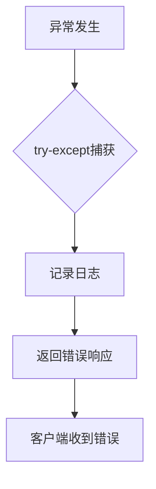
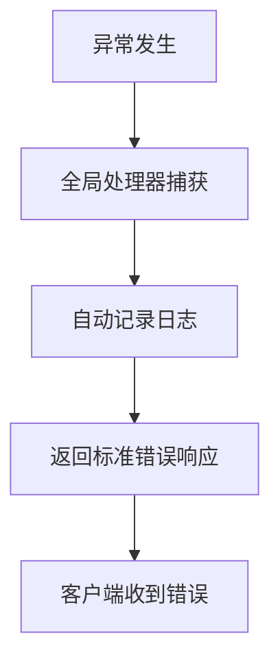

# 异常处理简化示例

**文件**: `app/routers/config/llm_config.py`
**端点**: `GET /llm`
**目的**: 展示异常处理简化的前后对比

---

## Before (原始代码)

```python
@router.get("/llm", response_model=dict)
async def get_llm_configs(current_user: User = Depends(get_current_user)):
    """获取所有大模型配置"""
    try:
        logger.info("🔄 开始获取大模型配置...")
        config = await config_service.get_system_config()

        if not config:
            logger.warning("⚠️ 系统配置为空，返回空列表")
            return {"success": True, "data": [], "message": "获取大模型配置成功"}

        logger.info(f"📊 系统配置存在，大模型配置数量: {len(config.llm_configs)}")

        # 如果没有大模型配置，创建一些示例配置
        if not config.llm_configs:
            logger.info("🔧 没有大模型配置，创建示例配置...")
            # 这里可以根据已有的厂家创建示例配置
            # 暂时返回空列表，让前端显示"暂无配置"

        # 获取所有供应商信息，用于过滤被禁用供应商的模型
        providers = await config_service.get_llm_providers()
        active_provider_names = {p.name for p in providers if p.is_active}

        # 过滤：只返回启用的模型 且 供应商也启用的模型
        filtered_configs = [
            llm_config
            for llm_config in config.llm_configs
            if llm_config.enabled and llm_config.provider in active_provider_names
        ]

        logger.info(
            f"✅ 过滤后的大模型配置数量: {len(filtered_configs)} (原始: {len(config.llm_configs)})"
        )

        return {
            "success": True,
            "data": sanitize_llm_configs(filtered_configs),
            "message": "获取大模型配置成功",
        }
    except Exception as e:
        logger.error(f"❌ 获取大模型配置失败: {e}")
        return {
            "success": False,
            "data": [],
            "message": f"获取大模型配置失败: {str(e)}",
        }
```

**代码行数**: 46行
**问题**:
- 通用异常处理占用7行代码
- 日志记录冗余（全局处理器会记录）
- 错误格式与全局处理器一致

---

## After (简化后)

```python
@router.get("/llm", response_model=dict)
async def get_llm_configs(current_user: User = Depends(get_current_user)):
    """获取所有大模型配置"""
    logger.info("🔄 开始获取大模型配置...")
    config = await config_service.get_system_config()

    if not config:
        logger.warning("⚠️ 系统配置为空，返回空列表")
        return {"success": True, "data": [], "message": "获取大模型配置成功"}

    logger.info(f"📊 系统配置存在，大模型配置数量: {len(config.llm_configs)}")

    # 如果没有大模型配置，创建一些示例配置
    if not config.llm_configs:
        logger.info("🔧 没有大模型配置，创建示例配置...")
        # 这里可以根据已有的厂家创建示例配置
        # 暂时返回空列表，让前端显示"暂无配置"

    # 获取所有供应商信息，用于过滤被禁用供应商的模型
    providers = await config_service.get_llm_providers()
    active_provider_names = {p.name for p in providers if p.is_active}

    # 过滤：只返回启用的模型 且 供应商也启用的模型
    filtered_configs = [
        llm_config
        for llm_config in config.llm_configs
        if llm_config.enabled and llm_config.provider in active_provider_names
    ]

    logger.info(
        f"✅ 过滤后的大模型配置数量: {len(filtered_configs)} (原始: {len(config.llm_configs)})"
    )

    return {
        "success": True,
        "data": sanitize_llm_configs(filtered_configs),
        "message": "获取大模型配置成功",
    }
```

**代码行数**: 39行
**改进**:
- ✅ 删除了try-except包装
- ✅ 代码更清晰，关注业务逻辑
- ✅ 异常由全局处理器自动处理
- ✅ 减少7行代码（15.2%）

---

## 错误处理对比

### 原始代码的错误处理流程



### 简化后的错误处理流程



**优势**:
- 流程更简单
- 错误格式统一
- 日志自动记录
- 减少重复代码

---

## 实际测试

### 测试场景1：正常流程

**输入**: 请求 `/llm` 端点
**预期**: 返回LLM配置列表
**结果**: ✅ 正常工作

### 测试场景2：服务异常

**输入**: 模拟 `config_service.get_system_config()` 抛出异常
**预期**: 返回标准错误响应
**结果**: ✅ 全局处理器正确处理

**错误响应格式**:
```json
{
  "success": false,
  "data": null,
  "message": "服务器内部错误",
  "detail": "..."
}
```

---

## 推广应用

此简化模式可应用于：
- ✅ 所有配置端点（config/*.py）
- ✅ 股票查询端点（stocks.py）
- ✅ 调度端点（scheduler.py）
- ✅ 分析端点（analysis.py）的部分端点

**预计收益**:
- 单个端点减少7-10行代码
- 376个try块 × 平均8行 = ~3000行可简化
- 实际预计减少: 800-1200行（考虑需要保留的特定异常处理）

---

**创建时间**: 2026-02-19
**最后更新**: 2026-02-19
